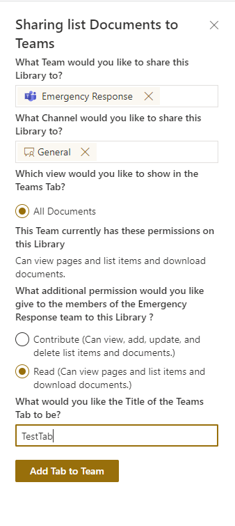

# Share List, Folder , or File to Teams


## Summary

This feature adds a list view command that lets a user Share the current List or Library, or any Folder or File in it to a Team. The extension grants the Team Members access to the selected object and Adds it as a Tab or in a Channel Message to the selected Teams Channel.




## Compatibility


-Incompatible-red.svg "SharePoint Server 2016 Feature Pack 2 requires SPFx 1.1")


## Applies to

* [SharePoint Framework](https://docs.microsoft.com/sharepoint/dev/spfx/sharepoint-framework-overview)
* [Microsoft 365 tenant](https://docs.microsoft.com/sharepoint/dev/spfx/set-up-your-developer-tenant)


## Solution

Solution|Author(s)
--------|---------
react-command-share-to-teams |Russell Gove (@russgove) www.linkedin.com/in/russellgove

## Version history

Version|Date|Comments
-------|----|--------
21.0|September 17, 2022|Initial release

## Prerequisites

This app requires access to the following Graph APIs:
 
 * ChannelMessage.Send
 * Team.ReadBasic.All
 * Channel.ReadBasic.All
 * TeamsTab.ReadWriteForTeam
 * TeamsTab.ReadWriteSelfForTeam
 * TeamsTab.ReadWrite.All
 


## Minimal Path to Awesome

* Clone this repository
* in the command line run:
  * `npm install`
  * `gulp serve`


## Features

This feature adds a list view command that lets a user Share the current List or Library, or any Folder or File in it to a Team. 
This is particularly useful if you have a file, or a set of files that need to be accessed or updated by multiple teams. The file(s)
can remain in your central repository, but members of your chosen team can access the file(s) from within their respective teams.

Teams has multiple ways to add Tabs for  content that resides in SharePoint with Teams members as outlined in this article: https://docs.microsoft.com/en-us/graph/teams-configuring-builtin-tabs.

It is possible to attach files (not folders or libraries) to a chat message.

This command set enables each of the above  options.

As noted in the artice above, when adding a file tab you have the option of using the Teams Word, Excel, PowerPoint, and PDF built-in tabs (com.microsoft.teamspace.tab.file.staticviewer.word, .excel, .powerpoint, .pdf) or we can us the built in  'SharePoint page and list tabs'(2a527703-1f6f-4559-a332-d8a7d288cd88) to show a SharePoint page that shows the document.

The configuation parameter called 'fileSharingMethod' controls which type of tab is added for files. Setting fileSharingMethod to 'page' causes the app to add file tabs using the 'SharePoint page and list tabs'(2a527703-1f6f-4559-a332-d8a7d288cd88). Setting fileSharingMethod to 'native' causes the app to add file tabs using the Teams Word, Excel, PowerPoint, and PDF built-in tabs (com.microsoft.teamspace.tab.file.staticviewer.word, .excel, .powerpoint, .pdf).

You can also disable file sharing completely by setting allowFileSharing to false.


## Debug URL for testing

Here's a debug URL for testing around this sample.

```
?loadSPFX=true&debugManifestsFile=https://localhost:4321/temp/manifests.js&customActions={"7c5a85c1-8b1e-4370-8198-642908faee60":{"location":"ClientSideExtension.ApplicationCustomizer","properties":{"testMessage":"Hello as property!"}}}
```

> Update based on your manifest id for easy testing of the sample
> Note that better pictures and documentation will increase the sample usage and the value you are providing for others. Thanks for your submissions inadvance! You rock ❤.
> DELETE THIS PARAGRAPH BEFORE SUBMITTING

## Disclaimer

**THIS CODE IS PROVIDED *AS IS* WITHOUT WARRANTY OF ANY KIND, EITHER EXPRESS OR IMPLIED, INCLUDING ANY IMPLIED WARRANTIES OF FITNESS FOR A PARTICULAR PURPOSE, MERCHANTABILITY, OR NON-INFRINGEMENT.**

## Help

We do not support samples, but we this community is always willing to help, and we want to improve these samples. We use GitHub to track issues, which makes it easy for  community members to volunteer their time and help resolve issues.

You can try looking at [issues related to this sample](https://github.com/pnp/sp-dev-fx-extensions/issues?q=label%3AYOUR-SOLUTION-NAME) to see if anybody else is having the same issues.

You can also try looking at [discussions related to this sample](https://github.com/pnp/sp-dev-fx-extensions/discussions?discussions_q=label%3AYOUR-SOLUTION-NAME) and see what the community is saying.

If you encounter any issues while using this sample, [create a new issue](https://github.com/pnp/sp-dev-fx-extensions/issues/new?assignees=&labels=Needs%3A+Triage+%3Amag%3A%2Ctype%3Abug-suspected&template=bug-report.yml&sample=YOUR-SOLUTION-NAME&authors=@YOURGITHUBUSERNAME&title=YOUR-SOLUTION-NAME%20-%20).

For questions regarding this sample, [create a new question](https://github.com/pnp/sp-dev-fx-extensions/issues/new?assignees=&labels=Needs%3A+Triage+%3Amag%3A%2Ctype%3Abug-suspected&template=question.yml&sample=YOUR-SOLUTION-NAME&authors=@YOURGITHUBUSERNAME&title=YOUR-SOLUTION-NAME%20-%20).

Finally, if you have an idea for improvement, [make a suggestion](https://github.com/pnp/sp-dev-fx-extensions/issues/new?assignees=&labels=Needs%3A+Triage+%3Amag%3A%2Ctype%3Abug-suspected&template=suggestion.yml&sample=YOUR-SOLUTION-NAME&authors=@YOURGITHUBUSERNAME&title=YOUR-SOLUTION-NAME%20-%20).


